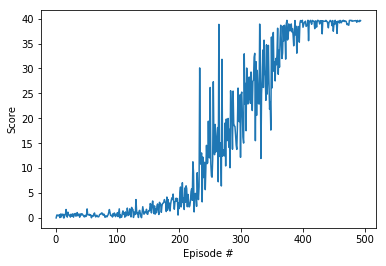
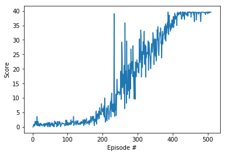

# DRLND - Continuous-Control
## Second project in the Deep Reinforcement Learning Nanodegree.

The report at hand shall provide an overview of the applied algorithms as well as opportunities to further evolve the agent and the neural network behind.

# Learning Algorithm

I choose to solve this project following the Deep Deterministic Policy Gradients (DDPG) approach. The solution is based on the code introduced during the course.

As a specialty I implemented the Actor model using a Dueling Network approach. This was in the beginning not very efficient but after a hint to normalize the input values performance increased significantly.

Tuning the parameters resulted in the following configuration but was a rather time consuming effort. I found that using the hyperparameter suggested in "CONTINUOUS  CONTROL  WITH  DEEP  REINFORCEMENT LEARNING" (https://arxiv.org/pdf/1509.02971.pdf) had not the best results with my model. For example a Weight_DECAY of 0.0001 made learning almost impossible.

 The following hyper parameters are used:

```
  BUFFER_SIZE = int(1e6)  # replay buffer size
  BATCH_SIZE = 256        # minibatch size
  GAMMA = 0.99            # discount factor
  TAU = 0.0001            # for soft update of target parameters
  LR_ACTOR = 0.00025      # learning rate of the actor
  LR_CRITIC = 0.00004      # learning rate of the critic
  WEIGHT_DECAY = 0        # L2 weight decay
```
Parameter setting as given below but with a critic learning rate set to LR_CRITIC = 0.0001 slightly increased the learning rate (finished after 391 episodes) but had more oscillations during the learning curve.
<br>


## Network Structures
### Actor (Policy) Model
DuelingQNetwork that maps state -> action values. Forward propagation.

```  
  # Input layer
  self.bn1 = nn.BatchNorm1d(state_size)
  self.fc1 = nn.Linear(state_size, fc1_units)

  # create hidden layers according to HIDDEN_SIZES
  self.bn2 = nn.BatchNorm1d(fc1_units)
  self.fc2 = nn.Linear(fc1_units, fc2_units)
  self.bn3 = nn.BatchNorm1d(fc2_units)
  self.fc3 = nn.Linear(fc2_units, fc1_duelling)

  # create duelling layers according to DUELLING_SIZES
  self.bn_adv_fc1 = nn.BatchNorm1d(fc1_duelling)
  self.adv_fc1 = nn.Linear(fc1_duelling, fc2_duelling)
  self.bn_val_fc1 = nn.BatchNorm1d(fc2_duelling)
  self.val_fc1 = nn.Linear(fc2_duelling, fcout_duelling)

  # Output layer
  self.bn_adv_out = nn.BatchNorm1d(fcout_duelling)
  self.adv_out = nn.Linear(fcout_duelling, action_size)
  self.bn_val_out = nn.BatchNorm1d(fcout_duelling)
  self.val_out = nn.Linear(fcout_duelling, 1)
```

### Critic (value) Network
Simple network with two hidden layers that maps (state, action) pairs -> Q-values.

```
  # Input Layer
  self.fc1 = nn.Linear(state_size, fc1_units)
  self.bn_s = nn.BatchNorm1d(fc1_units)

  # Hidden Layer
  self.fc2 = nn.Linear(fc1_units+action_size, fc2_units)
  self.fc3 = nn.Linear(fc2_units, 1)
```

# Plot of Rewards
A plot of reward is calculated every time you train the agent using `Continuous_Control.ipynb`.
<br>
With the parameter set given above the DDPG Agent solved the environment after 410 episodes.

<br>
The corresponding model weights are stored in `ddpg_network_actor_weight.pth` and `ddpg_network_critic_weight.pth`.

# Ideas for Future Work
In this project I concentrated on a augmented version of the DDPG approach but still there are plenty of opportunities to simply improve the performance parameters. Another general option would be to work with the `Noise-Function` for example implementing an adaptive approach. 

Looking at the learning curve specifically (including the 391 episode solution) shows, that it takes the agent 280 -290 episodes to reach an average value of +10. From +10 to +30 takes only 100 episodes and the agent is not droping below an average of 30 anymore. So an efficient improvement approach has to enhance learning accelartion at the beginning. I am still looking for a good idea.

Of course it would be interesting in measuring the performance of DDPG against other policy based approaches or even try to combine them.

2018-11-13
